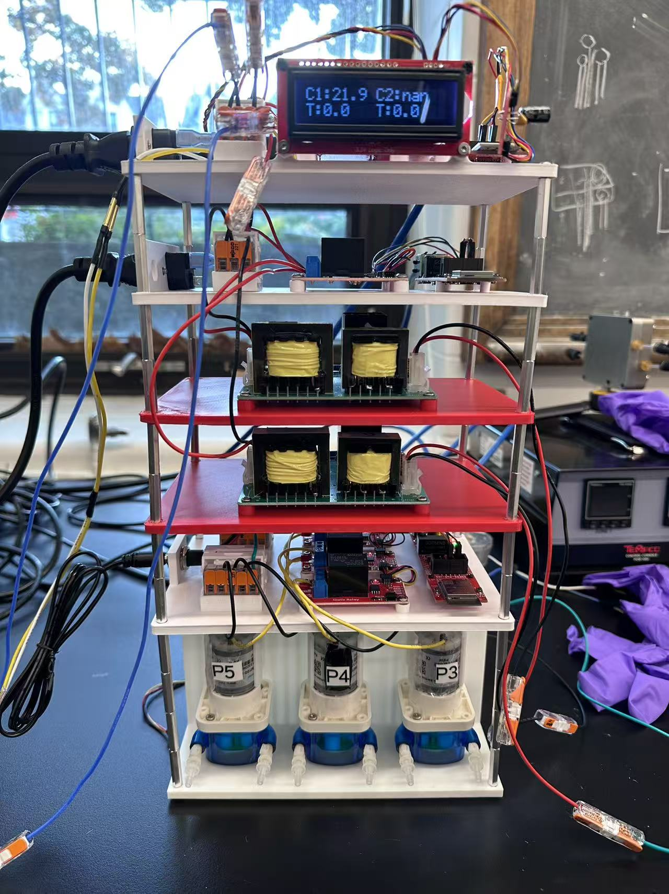
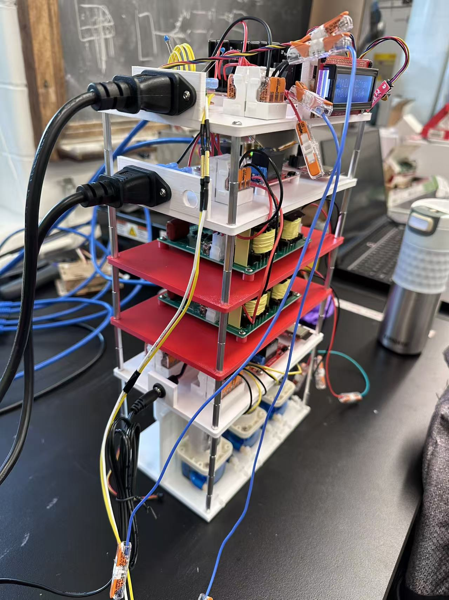
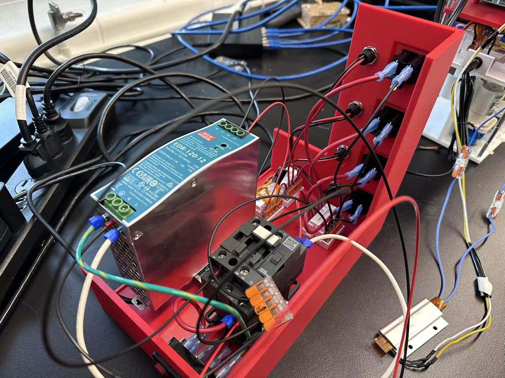

# Hardware Assembly — Modular Tower System

This folder contains the **3D-printable designs** and assembly instructions for the modular tower system, including the Power Tower base unit, interchangeable module plates, and accessories for the IoT control system.

## Quick Links

- **[Python API Documentation](../iot_mqtt/README.md)** - Control ESP32 devices via Python
- **[Device Firmware](../devices/)** - ESP32 firmware for pumps, heaters, ultrasonic controllers
- **[MQTT Broker Setup](../mosquitto_config/README.md)** - Mosquitto configuration and security

---

## CAD Files

```
hardware/
├── CAD_models/                 # 3D printable enclosure files
│   ├── Base Power Tower.3mf
│   ├── Heater Module - SSR.3mf
│   ├── Pump Module - 3 single relay.3mf
│   ├── Pump Module - quad relay.3mf
│   ├── Ultrasonic Driver Module.3mf
│   └── Ultrasonic Module - 2 single relay.3mf
│
├── BOM/                        # Bill of Materials 
│   └── Modular MQTT Tower.xlsx 
│
├── Images/                     # Images of the setup
│   ├── Modular_Tower_Front.jpg 
│   ├── Modular_Tower_Side.jpg 
│   └── Power_Tower.jpg 
│
└── README.md                   # This assembly guide
```

---

## System Overview

The hardware system uses a **modular tower architecture** with a central power unit and interchangeable modules:

### Power Tower (Base Unit)
- **Wall Connection**: 120VAC power inlet from wall socket with fuse + switch
- **Built-in Components**: 
  - **Contactor**: Main power switching and control
  - **Emergency Stop (E-Stop)**: Safety circuit for immediate power cutoff
  - **Power Supply**: 120VAC to 12VDC conversion
  - **Filtering**: Capacitors (1000 µF + 0.1 µF) and TVS diode for clean power

### Modular Tower System
The tower supports multiple **interchangeable modules** that stack on top of the power tower:

#### Pump Module (2-Plate Design)
- **Plate 1**: 3 pump slots for DC peristaltic pumps
- **Plate 2**: 12VDC power input + ESP32 + Qwiic relays + capacitors (1000 µF + 0.1 µF) + TVS diode
- **Power**: 12VDC distributed from main power tower
- **Control**: 3-channel pump control via Qwiic relays

#### Ultrasonic Module (3-Plate Design)
- **Plate 1**: 1 ultrasonic driver board (120W)
- **Plate 2**: 1 ultrasonic driver board (120W) 
- **Plate 3**: 120VAC power input + ESP32 + Qwiic relays
- **Power**: 120VAC distributed from main power tower
- **Control**: 2-channel ultrasonic driver control

#### Heater Module (1-Plate Design)
- **Plate 1**: ESP32 + Dual SSR + ADS1015 ADC + LCD display + 120VAC input
- **Power**: 120VAC distributed from main power tower
- **Control**: 2-channel SSR control using PID temperature control with thermistor sensing

### System Images


*Complete modular tower system - front view showing all modules stacked*


*Side view showing the modular stacking and cable management*


*Power Tower base unit with contactor, E-Stop, and power distribution*

---

## Assembly Process

### 1. Power Tower Assembly
1. Print the **Base Power Tower** enclosure
2. Add M6 heat inserts and secure the DIN rail (35.00mm x 7.50mm), M3 inserts for WAGO connector carriers, and power inlet + outlets
3. Install the **contactor, E-Stop, power supply, and filtering components** on DIN rail
4. Wire the **120VAC inlet** (16AWG) and **power distribution** to module connectors
5. Install **filtering capacitors** (1000 µF + 0.1 µF) and **TVS diode** for clean power
6. Test power distribution and safety circuits

### 2. Module Assembly
1. **Print module plates** for your specific configuration (pump, ultrasonic, heater)
2. Add appropriate heat inserts (M3, M2, M6) and secure WAGO connector carriers and power inlet
3. **Install electronics** on each plate:
   - **ESP32**: Mount with M2 screws 
   - **Relays/SSR**: Mount with M3 screws, maintain 5-7mm spacing for heat ventilation
   - **Filtering**: Install capacitors (1000 µF + 0.1 µF) and TVS diodes
4. **Wire power and communication** connections (16AWG for VAC, 20AWG for VDC)
5. **Test individual modules** before stacking

### 3. Tower Stacking
1. **Stack modules** on top of the Power Tower base using M3 standoffs (25 mm)
2. **Connect power and communication** between modules
3. **Install cable management** and strain relief
4. **Final testing** of complete system

---

## Hardware Components

### Power Tower Components
- **Contactor**: Main power switching (rated for your load requirements)
- **Emergency Stop**: NC contactor in series with actuator supply
- **Power Supply**: 120VAC to 12VDC conversion (rated for total module load)
- **Filtering**: Capacitors (1000 µF + 0.1 µF) and TVS diode for clean power
- **DIN Rail**: Standard 35.00mm x 7.50mm DIN rail for contactor and power supply mounting
- **WAGO Connectors**: Spring-loaded connectors for reliable connections

### Module Components
- **Olimex ESP32-POE-ISO**: Main controller with Ethernet and PoE
- **Qwiic Relays**: SparkFun relay modules for switching
- **Dual SSR**: Solid state relays for heater control
- **ADS1015**: ADC for temperature sensing
- **LCD Display**: 16x2 I²C display for status monitoring
- **Filtering Components**: Capacitors (1000 µF + 0.1 µF) and TVS diodes for each module

### Fasteners & Hardware

#### Standoffs & Spacing
- **M3 Standoffs**: 25mm standoffs for module stacking
- **Component Spacing**: 5-7mm between Qwiic relays and SSRs for heat ventilation

#### Heat-set Inserts
- **M3 × 4mm**: Standard board mounting
- **M6 × 4mm**: DIN rail mounting  
- **M2 × 3mm**: ESP32 board mounting

#### Screws & Fasteners
- **M6 screws**: DIN rail mounting
- **M3 screws**: All components except ESP32
- **M2 screws**: ESP32 board mounting only

#### Cable Specifications
- **16AWG**: 120VAC power connections
- **20AWG**: 12VDC power and signal connections
- **Ethernet**: Cat5e or Cat6 for network connections

---

## Power Ratings & Specifications

### Power Tower
- **Input**: 120VAC, 15A maximum (with appropriate fuse)
- **Output**: 12VDC, 10A maximum (adjust based on total module load)

### Module Power Requirements
- **Pump Module**: 12VDC, ~2A per pump (6A total for 3 pumps)
- **Ultrasonic Module**: 120VAC, ~1A per driver (2A total for 2 drivers)
- **Heater Module**: 120VAC, ~8A per heater (16A total for 2 heaters)

### Safety Ratings
- **TVS Diodes**: Appropriate voltage ratings for protection
- **Capacitors**: 1000 µF electrolytic + 0.1 µF ceramic for filtering
- **Cable Ratings**: 16AWG for 120VAC, 20AWG for 12VDC

---

## Print Settings (Reference)

- **Material:** PETG (preferred for heat & chemicals); PLA+ acceptable for dry bench use.
- **Nozzle/Layer:** 0.4 mm nozzle; 0.2 mm layer height.
- **Walls:** 3 perimeters; top/bottom 4–5 layers.
- **Infill:** 20–30% grid/gyroid.
- **Supports:** Only for board standoffs that overhang >50° (most parts are support-free).
- **Tolerances:** All snap/groove fits modeled at +0.3 mm clearance for PETG.

---

## Safety Notes

- Maintain **creepage/clearance** for mains relay sections (≥6 mm).  
- Use **printed guards** around AC terminals; never expose live screws.  
- Prefer **PETG/ABS** near warm SSRs or heaters; avoid PLA if ambient > 40 °C.  
- Label **inlets/outlets** and emergency-stop clearly (DXF included).

---

## Revision Log

- `v1.0` – Initial enclosure set and rail concept.  
- `v1.1` – Added LCD window and stronger lid ribs.  
- `v1.2` – Cable gland spacing increased, thermistor clamp added.


